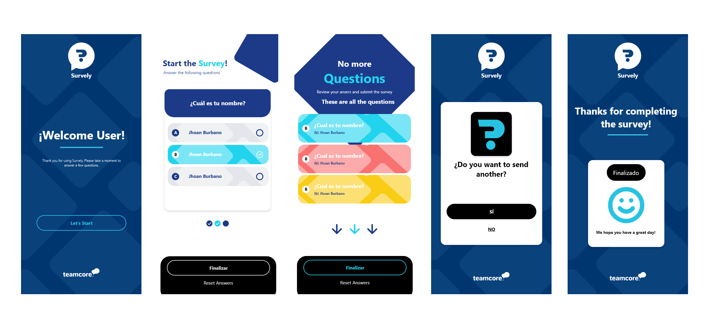

Aquí tienes un README detallado para tu aplicación, diseñado para proporcionar información clara y organizada para cualquiera que desee instalar, ejecutar y entender tu proyecto.

---

# Survely

<div style="text-align: center;">

</div>

Survely es una aplicación de encuestas rápida y eficiente diseñada para recolectar y gestionar respuestas en dispositivos iOS y Android. Ofrece una experiencia intuitiva, con un diseño limpio y un rendimiento optimizado gracias al motor Hermes. Ideal para equipos y empresas que buscan una herramienta simple y profesional para obtener retroalimentación en tiempo real.

Está optimizada para producción mediante Expo Application Services (EAS).

---

## Índice

1. [Características](#características)
2. [Requisitos Previos](#requisitos-previos)
3. [Instalación](#instalación)
4. [Configuración](#configuración)
5. [Compilación](#compilación)
6. [Scripts de NPM](#scripts-de-npm)
7. [Pruebas](#pruebas)
8. [Estructura del Proyecto](#estructura-del-proyecto)
9. [Licencia](#licencia)

---

## Proptotype (Adobe XD)

<div style="text-align: center;">

</div>

[Suverly_Flow](https://xd.adobe.com/view/7257b328-5a3b-4ae8-92e0-8c24f5e99a4f-2704/?fullscreen&hints=off)

## Características

- **Compatibilidad**: iOS y Android.
- **Gestión de Estado**: Redux Tool Kits.
- **Integración de Servicios**: Expo Application Services (EAS) para compilación de producción.
- **Navegación**: Reacy Navigation.
- **UI/UX Optimizada**: Diseño intuitivo con animaciones fluidas y una exeriencia de usuario agradable. Compatible con dispositivos de última generación
- **Unit Testing**: Jest (expo-jest, jsdom)
- **e2e**: Maestro (expo, ios, android)

---

## Requisitos Previos

- **Node.js**: versión 18 o superior.
- **Expo CLI**: instalación global con `npm install -g expo-cli`.
- **EAS CLI**: instalación global con `npm install -g eas-cli`.
- **Yarn**: instalación global con `npm install -g yarn` o `npm install -g yarn`.

---

## Instalación

Sigue los siguientes pasos para clonar y configurar el proyecto en tu máquina local.

1. **Clona el Repositorio**:

   ```bash
   git clone https://github.com/usuario/tc-survely-app.git
   cd tc-survely-app
   ```

2. **Instala las Dependencias**:

   ```bash
   yarn install
   ```

3. **Configura Expo**:

   Asegúrate de haber iniciado sesión en tu cuenta de Expo:

   ```bash
   expo login
   ```

---

## Configuración

### Configuración del Archivo `eas.json`

Este archivo contiene las configuraciones para la compilación de EAS. Asegúrate de tenerlo en la raíz del proyecto con el siguiente contenido:

```json
{
  "build": {
    "production": {
      "android": {
        "buildType": "apk"
      },
      "ios": {
        "buildType": "app-store"
      }
    },
    "development": {
      "android": {
        "buildType": "apk"
      },
      "ios": {
        "buildType": "simulator"
      }
    }
  }
}
```

### Configuración del `app.json`

Configura el archivo `app.json` para personalizar los detalles de la aplicación:

```json
{
  "expo": {
    "name": "Survely",
    "slug": "tc-survely-app",
    "version": "1.0.0",
    "orientation": "portrait",
    "icon": "./assets/icon.png",
    "splash": {
      "image": "./assets/splash.png",
      "resizeMode": "contain",
      "backgroundColor": "#ffffff"
    },
    "android": {
      "package": "com.usuario.tc-survely-app"
    },
    "ios": {
      "bundleIdentifier": "com.usuario.tc-survely-app"
    }
  }
}
```

---

## Compilación

### Compilar para Desarrollo

Para compilar una versión de desarrollo en un dispositivo o emulador local:

```bash
npx expo run:android
```

### Compilar para Producción con EAS

Para compilar un APK o IPA para producción:

1. **Compilación Local (APK)**

   ```bash
   eas build --platform android --profile production --local
   ```

2. **Compilación en la Nube**

   ```bash
   eas build --platform android --profile production
   eas build --platform ios --profile production
   ```

---

## Scripts de NPM

- **Iniciar el Servidor Expo**: `yarn start`
- **Construir APK (Local)**: `eas build --platform android --profile production --local`
- **Linter**: `yarn lint`
- **Pruebas Unitarias**: `yarn test`
- **Limpiar Caché**: `yarn clean`

---

## Pruebas

### Pruebas Unitarias y de Integración

El proyecto utiliza `jest` y `@testing-library/react-native` para las pruebas unitarias y de integración. Ejecuta las pruebas con el siguiente comando:

```bash
yarn test
```

Para ver la cobertura de las pruebas:

```bash
yarn test --coverage
```

### Configuración de Jest

Asegúrate de que el archivo `jest.config.js` esté correctamente configurado para manejar las pruebas y mocks necesarios.

---

## Estructura del Proyecto

```plaintext
├── assets              # Archivos de medios (imágenes, videos, etc.)
├── maestro             # Pruebas e2e
├── src                 # Código fuente de la aplicación
│   ├── components      # Componentes reutilizables
│   ├── screens         # Pantallas de la aplicación
│   │   └── __tests__   # Unit testing (jest)
│   ├── navigation      # Configuración de navegación
│   ├── hooks           # Hooks personalizados
│   ├── store           # Estado global de la aplicación (Redux u otro)
│   ├── styles          # Estilos globales
│   ├── services        # Servicios de llamada a API
│   └── utils           # Utilidades y funciones auxiliares
├── app.json            # Configuración de Expo
├── eas.json            # Configuración de EAS
├── package.json        # Configuración y dependencias del proyecto
└── README.md           # Documentación del proyecto
```

---

## Licencia

Este proyecto está bajo la Licencia MIT.
